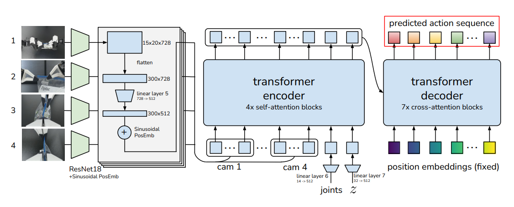

# Foundation Models for Manipulation: Overview

<div>
    
</div><br>

The world of robotics is evolving rapidly with the advent of **foundation models**: large  AI systems that enable robots to perform complex manipulation tasks with unprecedented flexibility. These models, which leverage techniques like **transformers** and **imitation learning**, allow robots to learn across diverse environments and tasks without task-specific programming. This shift is driving advances in critical applications, from industrial automation to home robot assistants.  

In this blog post, we’ll break down key foundation models for robotic manipulation, including:

- **Architectures of Foundation Models**: How modern models like ACT, Octo, OpenVLA and Helix are designed to enable robots to perform generalist tasks.
- **Action Representation**: Different methods for representing actions, such as continuous space, discretization and diffusion-based generation.
- **Finetuning Considerations**: Key insights on how to adapt these models for specific tasks and environments to ensure high performance in real-world applications.

Whether you're an AI researcher, roboticist or just curious about the future of autonomous robots, this guide will provide a clear and engaging overview of the exciting innovations shaping the next generation of robotic manipulation.

## 1) Action Chunk Transformer (ACT)

<div>
    
</div><br>

ACT leverages **transformer-based action chunking** and end-to-end imitation learning to enable low-cost robotic arms to perform complex tasks with high success rates. Developed as part of the ALOHA project, ACT learns from real-world demonstrations collected via a custom teleoperation setup. The model generates action sequences in a chunked manner, improving stability and reducing compounding errors over time. With only 10 minutes of demonstrations, ACT enables robots to achieve 80-90% success rates on fine manipulation tasks.

## Dataset  

ACT uses a dataset collected from real-world bimanual teleoperation experiments. The dataset consists of **human demonstrations**, meaning they gather their own data rather than relying on pre-existing datasets. The demonstration dataset consists of trajectories of **image observations, joint positions and executed actions**.  

## Input & Output  

### Input  
- **4 RGB images** (480×640 resolution) processed through ResNet18  
- **Joint positions** for the two robot arms (7+7=14 DOF)  

### Output  

- **Absolute joint positions** in chunks (e.g., next 100 timesteps)

## Model Architecture  

<div>
    
</div><br>

<div>
    
</div>

### Training Phase

#### Step 1: Sample Data  
From the demonstration dataset, we sample:  
- A sequence of **RGB images** from four 480×640 webcams  
- **Joint positions** of two 7-DOF robot arms (14-dimensional vector)  
- A target **action sequence** over the next $k$ time steps  

#### Step 2: Infer Latent Style Variable $z$  
The encoder is a BERT-style transformer encoder that receives:  
- A learned **[CLS]** token  
- The **current joint positions**, projected to the embedding dimension  
- The **target action sequence**, also linearly embedded  

These inputs form a $(k + 2) \times d_\text{embed}$ sequence. After passing through the transformer encoder, the **[CLS] token output** is used to predict the **mean and variance** of the latent style variable $z$, modeled as a diagonal Gaussian. Using the **reparameterization trick**, a sample of $z$ is drawn, enabling gradient backpropagation.

#### Step 3: Decode Predicted Action Sequence  
The decoder — the actual **policy** — takes as input:
- **Image features**: Each image is processed with a **ResNet18** to get a 15×20×512 feature map, flattened into a sequence of 300×512. For 4 cameras, this gives a total of 1200×512.
- **2D sinusoidal position embeddings** are added to preserve spatial structure.
- **Joint positions** and **$z$**, both projected to the same embedding dimension.

These inputs are concatenated into a 1202×512 sequence and passed through a transformer encoder. A transformer decoder uses cross-attention to generate a sequence of **$k \times 14$** outputs, representing joint positions for each time step.

---

### Inference Phase

At test time, the model uses only the **CVAE Decoder** as the policy. The encoder is discarded.

- The robot receives a new observation: **RGB images + joint positions**  
- These are processed exactly as during training (ResNet18 → flattened features → transformer encoder)  
- The **style variable $z$** is fixed to a **zero vector** (i.e., mean of the prior distribution)  
- The transformer decoder outputs a deterministic **$k \times 14$** tensor, corresponding to the next $k$ joint positions

This deterministic decoding provides stable, repeatable behavior, which is especially valuable for evaluation and deployment.

## Innovative Contributions

A central innovation of ACT is its use of **action chunking** — predicting sequences of joint positions over a fixed horizon (e.g., the next *k* steps) instead of single-step actions. This chunked prediction strategy reduces the task's effective time horizon and significantly mitigates compounding errors during execution.

## 2) Octo: An Open-Source Generalist Robot Policy

<div>
    
</div><br>

Octo is a large, transformer-based policy pretrained on 800k demonstrations from the Open X-Embodiment dataset. Designed for flexibility, it supports multiple robots, sensor setups, and task types — including language commands and goal images. Octo can be finetuned quickly on new environments and is fully open-source, making it a powerful foundation for scalable, general-purpose robotic learning.

## Dataset  

Octo is trained on a massive dataset of **800,000 robot trajectories** collected from the Open X-Embodiment dataset - the largest and most diverse robot manipulation dataset to date. This dataset brings together demonstrations from nine different robotic platforms, spanning a wide variety of manipulation tasks such as pick-and-place, tool use, button pressing and drawer opening or closing. The data is highly heterogeneous, featuring a mix of camera perspectives (e.g., wrist-mounted and third-person views), robots with different degrees of freedom, and task-conditioning signals in the form of either language instructions or goal images.

## Input & Output  

### **Input:**  

  - **RGB images** from multiple viewpoints (wrist cam, third-person).  
  - **Proprioceptive states** (joint positions, velocities).  
  - **Task conditioning**:  
    - **Text commands** (e.g., "Pick up the red cup").  
    - **Goal images** (e.g., "Make the scene look like this").  

### **Output:**  
- **Delta position Cartesian actions** in chunks.  


## Model Architecture  

**Octo** architecture consists of three main components:

1. **Input tokenizers** for processing observations and task specifications  
2. A **transformer backbone** that encodes the unified input sequence  
3. **Readout heads** that decode the embeddings into actionable commands

### Input Tokenization

Octo supports multiple input modalities including language commands, goal images, and diverse robot observations. Each of these is converted into a unified token representation using modality-specific encoders:

- **Language commands** are tokenized and encoded using a pretrained **T5-base** transformer model, producing a sequence of language embeddings.  
- **Goal images** and **RGB observations** (from wrist or third-person cameras) are passed through a shallow CNN, then divided into flattened patch sequences. 

After encoding, each token is assigned a **learned positional embedding**. These are concatenated into a single token sequence that includes both **task tokens** (e.g., language or goal images) and **observation tokens**, forming the complete input to the transformer.

### Transformer Backbone

The token sequence is processed by a **transformer model** with a block-wise attention mechanism. Observation tokens are allowed to attend causally - meaning only to past or current tokens - while also attending to task tokens. This structure ensures proper temporal consistency in policy outputs. 

Importantly, modality-specific blocks can be masked, enabling Octo to seamlessly handle datasets with missing modalities (e.g., no language input) and making it highly modular for downstream finetuning.

### Readout Heads & Action Prediction

To generate actions, **readout tokens** are inserted into the input sequence. These tokens attend to task and observation tokens but are **not attended to in return**. They act as passive readers, similar to the [CLS] token in BERT, summarizing the encoded information.

The output embeddings of the readout tokens are passed through a lightweight **action head** based on **diffusion models**, which predicts a **chunk of future actions**. This formulation allows Octo to model complex, multimodal action distributions and supports chunked action execution similar to ACT.

## Innovative contributions

One of Octo’s key design advantages is its **modular and adaptable architecture**. During finetuning, new sensors, tasks, or robot morphologies can be integrated by simply attaching new lightweight encoders, positional embeddings, or output heads — all **without modifying the pretrained transformer weights**. This stands in contrast to prior architectures that often require reinitialization or full retraining when adapting to new settings.

## 3) OpenVLA: An Open-Source Vision-Language-Action Model

<div>
    
</div><br>

## 3) OpenVLA: An Open-Source Vision-Language-Action Model

**OpenVLA** is a 7B-parameter open-source model for generalist robot manipulation, trained on **970k real-world demos** from the **Open X-Embodiment** dataset. It combines a **LLaMA 2 language model** with visual features from **DINOv2** and **SigLIP**, enabling rich vision-language grounding.

## Dataset

OpenVLA is trained on a curated subset of 970,000 robot demonstrations from the Open X-Embodiment dataset, which contains over 2 million trajectories from 70+ robotic platforms. To ensure consistency, only demonstrations with third-person camera views and single-arm end-effector control were included. For diversity, the team followed Octo’s data mixture strategy, prioritizing datasets with a wide range of tasks and scenes, while down-weighting redundant or narrow-scope data. This balance enables strong generalization across embodiments and environments.

## Input & Output  

### **Input:**  
- **Observation image(s):** One or more RGB frames from third-person cameras, processed by the visual encoder.  
- **Language instruction:** A natural language command describing the desired task (e.g., "stack the blocks" or "put the apple in the bowl").  

### **Output:**  
- **Delta position Cartesian actions as discrete tokens**  

## Model Architecture

OpenVLA builds on a modular vision-language foundation, with three primary components:

1. **Visual Encoder:**  
   - Dual-encoder setup: features from **DINOv2** and **SigLIP** are extracted independently and concatenated.  
   - Enables strong spatial grounding, helpful for manipulation tasks involving complex scenes.

2. **Projector:**  
   - A small 2-layer MLP that maps visual features into the language model's token embedding space.  
   - Ensures compatibility with the Llama 2 tokenizer and architecture.

3. **Language Model Backbone (Prismatic-7B):**  
   - Based on **Llama 2 (7B)**, pretrained on large-scale Internet text.  
   - Fine-tuned with a next-token prediction objective on mixed vision-language-action data.  
   - Predicts tokenized robot actions in an autoregressive fashion, conditioned on the task context.

This combination allows OpenVLA to act as a generalist visuomotor controller, understanding high-level language commands and grounding them into low-level action sequences.

## Innovative Contributions

A key innovation of OpenVLA is its ability to **ground natural language instructions in visual observations** by leveraging a large pretrained language model (LLaMA 2) within a unified vision-language-action architecture. This enables OpenVLA to understand and execute complex task instructions - such as “place the blue mug on the top shelf next to the red bowl” - without requiring handcrafted reward functions or rigid scripting.

## 4) Helix: A Vision-Language-Action Model for Humanoid Control

<div>
    
</div><br>

## Helix

Helix (**Figure AI**) is a Vision-Language-Action (VLA) model capable of controlling the **entire upper body of a humanoid robot** from raw pixels and natural language. It introduces a novel dual-system design - System 1 for fast, reactive control and System 2 for semantic understanding - enabling real-time dexterous manipulation grounded in language.

## Dataset

Helix is trained on a high-quality, diverse dataset consisting of approximately 500 hours of teleoperated demonstrations, collected across multiple robots and human operators. These demonstrations cover a broad spectrum of upper-body behaviors, including precise finger movements, coordinated arm motions and full-body pose adjustments. To generate language-conditioned training pairs at scale, an auto-labeling vision-language model (VLM) is used to create hindsight instructions. This model analyzes segmented video clips from onboard cameras and answers the prompt: “What instruction would you have given the robot to get the action seen in this video?” 

## Input & Output

### **Input:**  
- Monocular RGB image from the robot’s onboard camera  
- Robot state information (e.g., wrist pose, finger joint positions)  
- Natural language command specifying the desired behavior  

### **Output:**  
- Continuous 35-DoF action vector at 200Hz, including:  
  - Wrist pose targets  
  - Finger movements  
  - Head and torso orientation  

## Model Architecture

Helix consists of two main components that operate at different frequencies: **System 2 (S2)** for high-level perception and planning, and **System 1 (S1)** for low-level  real-time control.

### **System 2 (S2): Vision-Language Model**

S2 is a 7B-parameter vision-language model (VLM), pretrained on large-scale internet data. It processes:
- Monocular RGB images from the robot’s onboard camera
- Proprioceptive robot state (e.g., wrist pose, finger joint positions)
- A natural language command

These inputs are encoded into a shared embedding space and distilled into a single **latent semantic vector**, which summarizes the high-level task intent. This vector is passed to S1 to guide motor control.

### **System 1 (S1): Visuomotor Transformer**

S1 is an 80M-parameter cross-attention encoder-decoder transformer optimized for reactive control at **200 Hz**. It uses:
- A multi-scale convolutional vision backbone pretrained in simulation
- The same image and state inputs as S2
- The latent vector from S2 as task-conditioning input

These inputs are combined and processed to produce continuous control outputs for:
- End-effector poses (wrist and arm)
- Finger flexion and abduction
- Head and torso orientation
- A scalar representing task progress (used for predicting completion)

## Innovative Contributions

Helix introduces a novel dual-system architecture inspired by "System 1 / System 2" reasoning. **System 2** (S2) handles slow, semantic understanding using a large vision-language model, while **System 1** (S1) performs fast, reactive control at 200 Hz. This separation allows Helix to combine internet-scale language grounding with high-frequency, whole upper-body humanoid control.

## 5) Action Representation

One of the most crucial components in any robot policy is how actions are represented and generated. Different approaches make different trade-offs in terms of generalization, expressivity, and training stability. This chapter outlines and compares three prominent action representation strategies: **MSE regression**, **discretization**, and **diffusion-based generation**.

### 1. Continuous Regression with MSE Loss

The most straightforward method is to **directly regress the next action** (e.g., joint positions or torques) using **Mean Squared Error (MSE)**:

```math
\mathcal{L}_{\text{MSE}} = \frac{1}{T} \sum_{t=1}^{T} \left\| a_t^{\text{pred}} - a_t^{\text{true}} \right\|^2
```

This method assumes a **unimodal distribution**, producing the "average" best action. It works well when demonstrations are consistent, but struggles in multimodal settings, where multiple distinct strategies exist (e.g., grasping an object from different angles).

---

### 2. Discretized Action Space

Instead of predicting continuous values, one can **discretize** each action dimension into $K$ bins and treat action generation as a **classification task**:

- Each action $a_i$ is split into $K$ bins.
- The model outputs a probability distribution over bins.

Training is done using **cross-entropy loss**:

```math
\mathcal{L}_{\text{disc}} = - \sum_{i=1}^{D} \log p_i(a_i)
```

This approach enables **multi-modal prediction** by selecting among multiple possible bins. However, it introduces quantization errors and can lead to coarse, jittery behavior in fine-grained tasks.

---

### 3. Diffusion Models for Action Generation

Diffusion models provide a powerful way to represent **multi-modal**, continuous action distributions, especially when predicting **chunks of actions** rather than single steps. These models consist of two phases: a **forward process** (adding noise) and a **reverse process** (iterative denoising). 

#### Forward Process (Training Phase)

In the forward process, we gradually add Gaussian noise to a ground-truth action chunk \( a_0 \), generating noisy versions \( x_k \) at timestep \( k \):

$$
x_k = \sqrt{\alpha_k} a_0 + \sqrt{1 - \alpha_k} \, \epsilon, \quad \epsilon \sim \mathcal{N}(0, I)
$$

The model is trained to **predict the noise** that was added:

```math
\mathcal{L}_{\text{diff}} = \mathbb{E}_{a_0, \epsilon, k} \left[ \left\| \epsilon - \epsilon_\theta(x_k, e, k) \right\|^2 \right]
```

Where:
- $x_k$ is the noisy action chunk at timestep $k$
- $\epsilon_\theta$ is the denoising network (diffusion head)
- $e$ is the context embedding from the transformer

**</br>Training Pseudocode**:

```python
def diffusion_training_step(a0, context_embedding, noise_schedule):

    k = sample_timestep()
    eps = torch.randn_like(a0)
    alpha_k = noise_schedule.alpha(k)

    # Forward diffusion (noisy input)
    x_k = torch.sqrt(alpha_k) * a0 + torch.sqrt(1 - alpha_k) * eps

    # Predict noise
    eps_pred = denoise_net(x_k, context_embedding, k)

    # Loss: predict the added noise
    loss = F.mse_loss(eps_pred, eps)

    return loss
```


#### Reverse Process (Inference Phase)

Once a diffusion model is trained, generating actions is done via a **reverse denoising process**, starting from random noise and progressively refining it into a meaningful action or action chunk.

Given a noisy action sample $x_k$, the model denoises it using:

$$
x_{k-1} = \alpha_k \left(x_k - \gamma_k \, \epsilon_\theta(x_k, e, k)\right) + \sigma_k \, \mathcal{N}(0, I)
$$

Where:
- $x_k$ is the noisy action chunk at step $k$
- $\epsilon_\theta(x_k, e, k)$ is the predicted noise from the denoising network
- $e$ is the transformer-derived context embedding
- $\alpha_k, \gamma_k, \sigma_k$ are parameters from a cosine or linear noise schedule
- The added Gaussian noise $\mathcal{N}(0, I)$ ensures sample diversity

This step is iteratively applied from a pure noise sample $x_T$ down to $x_0$, the final denoised action chunk.

#### Inference Pseudocode (Chunk Prediction)

```python
def generate_action_chunk(context_embedding, T=50):

    # Start from pure Gaussian noise
    x = torch.randn(batch_size, action_dim)

    # Iteratively denoise
    for k in reversed(range(T)):
        eps_pred = denoise_net(x, context_embedding, k)
        alpha_k, gamma_k, sigma_k = noise_schedule.get(k)

        # Reverse denoising step
        x = alpha_k * (x - gamma_k * eps_pred)
        if k > 0:
            x += sigma_k * torch.randn_like(x)

    return x  # Final predicted action chunk
```

## 6) Key Works and Citations

- **T. Zhao, V. Kumar**: [*Learning Fine-Grained Bimanual Manipulation with Low-Cost Hardware*](https://arxiv.org/pdf/2304.13705)
- **D. Ghosh, H. Walke**: [*Octo: An Open-Source Generalist Robot Policy*](https://arxiv.org/pdf/2405.12213)
- **A. Brohan, N. Brown**: [*RT-2: Vision-Language-Action Models Transfer Web Knowledge to Robotic Control*](https://arxiv.org/pdf/2307.15818)
- **M. Kim, K. Pertsch**: [*OpenVLA: An Open-Source Vision-Language-Action Model*](https://arxiv.org/pdf/2406.09246)
- **K. Black, N. Brown**: [*π0: A Vision-Language-Action Flow Model for General Robot Control*](https://arxiv.org/pdf/2410.24164)
- **Figure AI**: [*Helix: A Vision-Language-Action Model for Generalist Humanoid Control*](https://www.figure.ai/news/helix)
- **C. Chi, Z. Xu, S. Feng**: [*Diffusion Policy: Visuomotor Policy Learning via Action Diffusion*](https://arxiv.org/pdf/2303.04137)
- **K. Pertsch, K. Stachowicz**: [*FAST: Efficient Action Tokenization for Vision-Language-Action Models*](https://arxiv.org/pdf/2501.09747)
